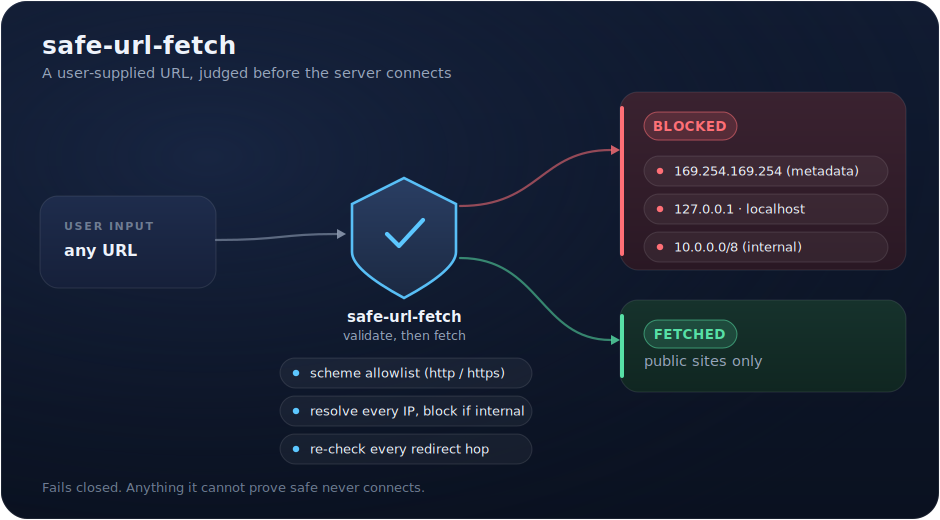

# safe-url-fetch

Fetch a user-supplied URL on your server without opening an SSRF hole. One small Python module, no list of "bad IPs" to maintain, and a test suite that runs with zero network. Every check exists because skipping it is how internal systems get reached from the outside.

<p align="center">
  
</p>

## The story

A SaaS I run lets a user paste their website so the app can grab their logo and brand color. The instant a server fetches a URL a user typed, that fetch becomes a weapon. Point it at `http://169.254.169.254/` on a cloud box and it reads the instance credentials. Point it at `http://localhost:6379` and it talks to the internal Redis. Point it at `http://10.0.0.5/admin` and it reaches a neighbor on the private network. The user never sees those addresses. The server does the connecting, so the server's trust is what gets spent.

That class of bug is SSRF, server-side request forgery, and it is one of the most common ways the inside of an app gets touched from the outside. This module is the guard I put in front of every fetch that takes a URL from a person.

## What's in the box

```
safe_url_fetch.py        the guard: validate_url() and fetch()
test_safe_url_fetch.py   18 tests, no network (DNS and HTTP are faked)
requirements.txt         requests, and nothing else
```

## Usage

```python
from safe_url_fetch import fetch, validate_url, SafeURLError

# Validate only (you do your own fetching):
try:
    validate_url(user_supplied_url)
except SafeURLError as e:
    return reject(str(e))

# Validate and fetch, with redirects re-checked on every hop:
try:
    body = fetch(user_supplied_url, max_bytes=2_000_000, timeout=5)
except SafeURLError as e:
    return reject(str(e))
```

`fetch` returns the body as `bytes` or raises `SafeURLError`. Nothing unsafe ever comes back as a value.

## The four rules it enforces

1. **Scheme allowlist: http and https only.** This alone kills `file:///etc/passwd`, `gopher://`, and `data:` payloads.
2. **Resolve every IP the host maps to, and refuse if any one of them is not globally routable.** The check is `ipaddress.ip_address(ip).is_global`, not a hand-written private-range list. That single standard-library call also rejects carrier-grade NAT (`100.64.0.0/10`), `0.0.0.0/8`, link-local (`169.254.0.0/16`, the cloud-metadata range), and IPv6 unique-local, with nothing to keep updated. Checking *every* DNS answer, not just the first, defeats the split-horizon trick where one record is public and another is internal.
3. **Follow redirects by hand and re-validate every hop.** A public URL that returns `302 Location: http://169.254.169.254/` is the textbook bypass of a one-shot check. Here, `allow_redirects` is off and each destination runs through the full validation before it is connected to.
4. **Cap the timeout, the response size, and the redirect count.** The size cap counts bytes as they stream in, because a `Content-Length` header is a claim, not a guarantee.

## Design decisions that matter

**Fail closed, always.** An IP that will not parse, a host that will not resolve, a URL with no host: every uncertain case raises `SafeURLError`. The opposite of the agent guard I also publish, and correct for the opposite reason. A safety check you cannot prove passed has not passed.

**`is_global` instead of a blocklist.** Hand-rolled lists of private ranges age badly and always forget something. CGNAT and `0.0.0.0/8` are the two everyone leaves out. Leaning on `ipaddress` means the standard library maintains the list.

**Let the resolver canonicalize.** `http://2130706433/` is a perfectly legal way to write `http://127.0.0.1/`. Rather than special-case decimal, octal, and hex IP literals, the guard hands the host to `getaddrinfo` and judges whatever it resolves to. The obfuscation resolves, then gets blocked.

**The honest residual risk.** Validation resolves the host, then `requests` resolves it again at connect time. A DNS record with a zero TTL can answer "public" during validation and "private" a millisecond later at connect. This module accepts that gap on purpose, and it is only safe to accept when the body is not handed back to an untrusted caller. In the logo-and-color use it was built for, a successful internal hit returns a near-empty oracle, so real exploitability rounds to nothing. If you return full response bodies to untrusted users, close the gap by pinning the validated IP and connecting straight to it with a custom transport adapter. The trade-off is written down in the module docstring so the next person inherits the reasoning, not just the code.

## Tests

```bash
python3 test_safe_url_fetch.py
```

No network and no third-party package required: DNS is a fake resolver, HTTP is a scripted fake, and the redirect-to-internal bypass is tested directly. The 18 cases cover IP classification (including IPv4-mapped IPv6 and unparseable input), the scheme allowlist, split-horizon hosts, relative and absolute redirects, redirect loops, and the streaming size cap.

## Who made this

Kyle Miller. I build AI systems and custom software that run real businesses: e-commerce automation, internal tools, content engines. This repo is a piece of one of my production apps, extracted and cleaned up. The business logic stays home.

**Hire me:** [themisfoundry.com](https://themisfoundry.com)

## License

MIT
